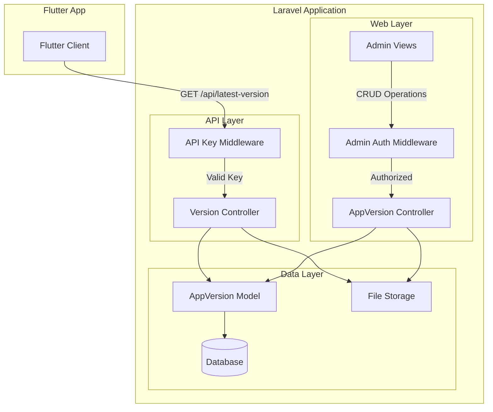

# Design Document

## Overview

Sistem manajemen versi APK terdiri dari dua komponen utama: Admin Dashboard untuk CRUD operations dan API endpoint untuk Flutter App. Sistem ini mengintegrasikan dengan infrastruktur Laravel yang sudah ada, memanfaatkan middleware admin yang sudah terdaftar dan menambahkan middleware API Key baru untuk keamanan endpoint publik.

### Key Design Decisions

1. **API Key Authentication**: Menggunakan custom middleware dengan header X-Api-Key untuk autentikasi sederhana namun efektif untuk mobile app
2. **File Storage**: Menggunakan Laravel Storage dengan disk public untuk memudahkan akses download
3. **Version Ordering**: Menggunakan timestamp created_at untuk menentukan versi terbaru (bukan version_code) untuk fleksibilitas
4. **Resource Routes**: Menggunakan Laravel Resource Controller dengan pembatasan hanya pada method yang diperlukan
5. **Bootstrap UI**: Konsisten dengan admin dashboard yang sudah ada menggunakan Bootstrap 5 dan Bootstrap Icons

## Architecture

### System Components



### Request Flow

#### API Request Flow (Flutter App)
1. Flutter App sends GET request to `/api/latest-version` with `X-Api-Key` header
2. API Key Middleware validates the key against `FLUTTER_API_KEY` env variable
3. If valid, Version Controller queries latest AppVersion from database
4. Controller generates download URL using Storage facade
5. JSON response returned with version details

#### Admin Request Flow (Upload APK)
1. Admin submits form with APK file and version details
2. Admin Auth Middleware validates session
3. AppVersion Controller validates form data
4. File stored to `storage/app/public/updates/` directory
5. Database record created with file path
6. Redirect to index page with success message

## Components and Interfaces

### 1. Database Schema

#### Migration: create_app_versions_table

```php
Schema::create('app_versions', function (Blueprint $table) {
    $table->id();
    $table->string('version_name');        // e.g., "1.2.0"
    $table->integer('version_code')->unique();  // e.g., 3
    $table->string('file_path');           // storage path
    $table->text('release_notes')->nullable();
    $table->timestamps();
});
```

**Indexes:**
- Primary key on `id`
- Unique index on `version_code`
- Index on `created_at` for efficient latest version queries

### 2. Models

#### AppVersion Model

**Location:** `app/Models/AppVersion.php`

**Properties:**
```php
protected $fillable = [
    'version_name',
    'version_code',
    'file_path',
    'release_notes'
];

protected $casts = [
    'version_code' => 'integer',
];
```

**Methods:**
- Standard Eloquent methods (no custom methods needed)
- Relies on `latest()` scope for ordering by created_at

### 3. Middleware

#### EnsureApiKeyIsValid Middleware

**Location:** `app/Http/Middleware/EnsureApiKeyIsValid.php`

**Purpose:** Validate X-Api-Key header against environment configuration

**Logic:**
```php
public function handle(Request $request, Closure $next)
{
    $apiKey = $request->header('X-Api-Key');
    $validKey = env('FLUTTER_API_KEY');
    
    if (!$apiKey || $apiKey !== $validKey) {
        return response()->json([
            'message' => 'Unauthorized'
        ], 401);
    }
    
    return $next($request);
}
```

**Registration:** Add to `$middlewareAliases` in `app/Http/Kernel.php`:
```php
'auth.apikey' => \App\Http\Middleware\EnsureApiKeyIsValid::class,
```

### 4. Controllers

#### Version Controller (API)

**Location:** `app/Http/Controllers/Api/VersionController.php`

**Namespace:** `App\Http\Controllers\Api`

**Methods:**

##### getLatestVersion()

**Purpose:** Return latest APK version information

**Logic:**
1. Query: `AppVersion::latest()->first()`
2. If null, return 404 error
3. Generate download URL: `Storage::url($version->file_path)`
4. Return JSON response

**Response Format (Success - 200):**
```json
{
    "status": "success",
    "data": {
        "version_name": "1.2.0",
        "version_code": 3,
        "release_notes": "Bug fixes and improvements",
        "download_url": "http://domain.com/storage/updates/app-v1.2.0.apk"
    }
}
```

**Response Format (Error - 404):**
```json
{
    "status": "error",
    "message": "No version available"
}
```

#### AppVersion Controller (Web)

**Location:** `app/Http/Controllers/AppVersionController.php`

**Namespace:** `App\Http\Controllers`

**Methods:**

##### index()
- Query: `AppVersion::latest()->paginate(10)`
- Return view: `admin.app-versions.index`
- Pass data: `$versions`

##### create()
- Return view: `admin.app-versions.create`

##### store(Request $request)

**Validation Rules:**
```php
$validated = $request->validate([
    'version_name' => 'required|string|max:255',
    'version_code' => 'required|integer|unique:app_versions,version_code',
    'release_notes' => 'nullable|string',
    'apk_file' => 'required|file|mimes:apk|max:102400', // 150MB max
]);
```

**Logic:**
1. Validate request
2. Store file: `$path = $request->file('apk_file')->store('public/updates')`
3. Create record: `AppVersion::create([...])`
4. Redirect with success message

##### destroy(AppVersion $appVersion)

**Logic:**
1. Delete file: `Storage::delete($appVersion->file_path)`
2. Delete record: `$appVersion->delete()`
3. Redirect with success message

**Note:** No show, edit, or update methods needed per requirements

### 5. Routes

#### API Routes

**File:** `routes/api.php`

**Changes:**
```php
// Wrap existing and new routes in API Key middleware group
Route::middleware(['throttle:60,1', 'log.api', 'auth.apikey'])->group(function () {
    // Existing route (moved into group)
    Route::post('/check-location', [LocationController::class, 'checkLocation']);
    Route::get('/check-location', [LocationController::class, 'checkLocation']);
    
    // New route
    Route::get('/latest-version', [Api\VersionController::class, 'getLatestVersion']);
});
```

#### Web Routes

**File:** `routes/web.php`

**Changes:**
```php
// Inside existing admin middleware group
Route::middleware(['admin.auth'])->prefix('admin')->name('admin.')->group(function () {
    // ... existing routes ...
    
    // New resource route
    Route::resource('app-versions', AppVersionController::class)
        ->except(['show', 'edit', 'update']);
});
```

**Generated Routes:**
- GET `/admin/app-versions` → index
- GET `/admin/app-versions/create` → create
- POST `/admin/app-versions` → store
- DELETE `/admin/app-versions/{id}` → destroy

## Data Models

### AppVersion Entity

| Field | Type | Constraints | Description |
|-------|------|-------------|-------------|
| id | bigint | PK, auto-increment | Primary identifier |
| version_name | varchar(255) | required | Human-readable version (e.g., "1.2.0") |
| version_code | integer | required, unique | Numeric version code for comparison |
| file_path | varchar(255) | required | Storage path to APK file |
| release_notes | text | nullable | Changelog or release information |
| created_at | timestamp | auto | Record creation time |
| updated_at | timestamp | auto | Record update time |

### Relationships

No relationships needed for this feature. AppVersion is a standalone entity.

## User Interface Design

### Admin Views Structure

```
resources/views/admin/app-versions/
├── index.blade.php    (List all versions)
└── create.blade.php   (Upload form)
```

### Index Page (index.blade.php)

**Layout:** Extends `layouts.admin`

**Components:**
1. **Page Header**
   - Title: "Manajemen Versi APK"
   - Button: "Upload Versi Baru" (primary, links to create route)

2. **Versions Table**
   - Columns: Version Name, Version Code, Upload Date, Actions
   - Pagination: 10 items per page
   - Actions: Delete button (red, with confirmation)

3. **Empty State**
   - Message when no versions exist
   - Call-to-action to upload first version

**Bootstrap Classes:**
- Card: `card`, `card-header`, `card-body`
- Table: `table`, `table-striped`, `table-hover`
- Buttons: `btn btn-primary`, `btn btn-danger btn-sm`

### Create Page (create.blade.php)

**Layout:** Extends `layouts.admin`

**Components:**
1. **Page Header**
   - Title: "Upload Versi Baru"
   - Back button to index

2. **Upload Form**
   - Form attributes: `method="POST"`, `enctype="multipart/form-data"`
   - CSRF token included
   
3. **Form Fields:**
   - Version Name (text input, required)
   - Version Code (number input, required)
   - Release Notes (textarea, optional)
   - APK File (file input, required, accept=".apk")
   
4. **Form Actions:**
   - Submit button: "Upload"
   - Cancel button: Link back to index

**Validation Display:**
- Error messages displayed below each field
- Bootstrap validation classes: `is-invalid`, `invalid-feedback`

### Sidebar Integration

**File:** `resources/views/layouts/admin.blade.php`

**Addition to sidebar nav:**
```html
<li class="nav-item">
    <a class="nav-link {{ request()->routeIs('admin.app-versions.*') ? 'active' : '' }}" 
       href="{{ route('admin.app-versions.index') }}">
        <i class="bi bi-phone-fill"></i>
        App Updates
    </a>
</li>
```

**Icon:** Bootstrap Icon `bi-phone-fill` or `bi-download`

## Error Handling

### API Errors

| Scenario | Status Code | Response |
|----------|-------------|----------|
| Missing API Key | 401 | `{"message": "Unauthorized"}` |
| Invalid API Key | 401 | `{"message": "Unauthorized"}` |
| No version available | 404 | `{"status": "error", "message": "No version available"}` |
| Server error | 500 | `{"status": "error", "message": "Internal server error"}` |

### Admin Errors

| Scenario | Handling |
|----------|----------|
| Validation failure | Redirect back with errors and old input |
| Duplicate version_code | Validation error: "Version code already exists" |
| Invalid file type | Validation error: "File must be an APK" |
| File too large | Validation error: "File size exceeds 150MB" |
| Storage failure | Catch exception, show error message |
| File not found on delete | Silent handling, still delete record |

### Error Handling Patterns

**Controller Try-Catch:**
```php
try {
    // File operations
    $path = $request->file('apk_file')->store('public/updates');
    AppVersion::create([...]);
    return redirect()->route('admin.app-versions.index')
        ->with('success', 'Version uploaded successfully');
} catch (\Exception $e) {
    return redirect()->back()
        ->with('error', 'Failed to upload version: ' . $e->getMessage())
        ->withInput();
}
```

**File Deletion Safety:**
```php
if (Storage::exists($appVersion->file_path)) {
    Storage::delete($appVersion->file_path);
}
$appVersion->delete();
```

## Security Considerations

### API Security

1. **API Key Protection**
   - Store in `.env` file (not in version control)
   - Use strong, random key (minimum 32 characters)
   - Rotate periodically

2. **Rate Limiting**
   - Existing throttle middleware (60 requests per minute)
   - Prevents brute force attacks

3. **HTTPS Requirement**
   - Production should enforce HTTPS
   - Prevents API key interception

### Admin Security

1. **Authentication**
   - Existing `admin.auth` middleware
   - Session-based authentication

2. **File Upload Security**
   - MIME type validation (apk only)
   - File size limit (150MB)
   - Store in non-public directory initially, serve via Storage::url()

3. **CSRF Protection**
   - Laravel CSRF tokens on all forms
   - Automatic validation via middleware

### Storage Security

1. **File Permissions**
   - Storage directory should have proper permissions (755 for directories, 644 for files)
   - Symbolic link from `public/storage` to `storage/app/public`

2. **File Naming**
   - Laravel generates unique filenames automatically
   - Prevents file overwriting

## Configuration

### Environment Variables

**Add to `.env` and `.env.example`:**
```env
FLUTTER_API_KEY=your_secure_random_key_here_minimum_32_characters
```

**Generation Command (for documentation):**
```bash
php artisan tinker
>>> Str::random(64)
```

### Storage Configuration

**Ensure symbolic link exists:**
```bash
php artisan storage:link
```

This creates: `public/storage` → `storage/app/public`

**Storage disk:** Uses default `public` disk defined in `config/filesystems.php`

### File Upload Limits

**PHP Configuration (php.ini):**
```ini
upload_max_filesize = 150M
post_max_size = 150M
```

**Laravel Configuration:**
- Validation rule: `max:102400` (150MB in KB)

## Testing Strategy

### Unit Tests

**Test Cases:**

1. **AppVersion Model**
   - Test fillable attributes
   - Test version_code uniqueness constraint
   - Test timestamps are set

2. **API Key Middleware**
   - Test request with valid API key passes
   - Test request without API key returns 401
   - Test request with invalid API key returns 401

### Feature Tests

**Test Cases:**

1. **API Endpoint Tests**
   - Test `/api/latest-version` returns latest version with valid API key
   - Test `/api/latest-version` returns 404 when no versions exist
   - Test `/api/latest-version` returns 401 without API key
   - Test download URL is properly formatted

2. **Admin CRUD Tests**
   - Test index page displays versions list
   - Test create page displays form
   - Test store creates version and uploads file
   - Test store validation (required fields, unique version_code, file type)
   - Test destroy deletes version and file
   - Test unauthorized access is blocked

3. **Integration Tests**
   - Test complete upload flow (form → storage → database)
   - Test complete delete flow (database → storage cleanup)
   - Test API returns newly uploaded version

### Manual Testing Checklist

**Admin Dashboard:**
- [ ] Upload APK with all fields
- [ ] Upload APK without optional release_notes
- [ ] Try duplicate version_code (should fail)
- [ ] Try non-APK file (should fail)
- [ ] View versions list with pagination
- [ ] Delete version (file and record removed)
- [ ] Verify sidebar link works and highlights correctly

**API Endpoint:**
- [ ] Call API with valid key (should return latest version)
- [ ] Call API without key (should return 401)
- [ ] Call API with invalid key (should return 401)
- [ ] Verify download URL is accessible
- [ ] Test with no versions in database (should return 404)

**Flutter Integration:**
- [ ] Flutter app can fetch latest version
- [ ] Flutter app can download APK from URL
- [ ] Flutter app handles 404 gracefully

## Implementation Notes

### File Storage Path

Files stored at: `storage/app/public/updates/`
Accessible via: `public/storage/updates/`
URL generated by: `Storage::url($path)`

### Version Ordering

Latest version determined by `created_at DESC`, not by `version_code`. This allows flexibility if versions are uploaded out of order.

### No Edit Functionality

Per requirements, no edit/update functionality. If version details need correction, delete and re-upload.

### Pagination

Admin index uses Laravel pagination (10 per page). Includes Bootstrap-styled pagination links.

### Flash Messages

Uses Laravel session flash messages with Bootstrap alert components (already implemented in admin layout).

## Dependencies

### Existing Dependencies (No Changes Needed)
- Laravel Framework 10.x
- Laravel Storage (included)
- Bootstrap 5.3.0 (already in admin layout)
- Bootstrap Icons (already in admin layout)

### No Additional Packages Required

All functionality can be implemented with Laravel core features.

## Migration Path

### Database Migration

```bash
php artisan make:migration create_app_versions_table
php artisan migrate
```

### Storage Setup

```bash
php artisan storage:link
```

### Environment Configuration

1. Add `FLUTTER_API_KEY` to `.env`
2. Generate secure random key
3. Update `.env.example` with placeholder

### Deployment Checklist

- [ ] Run migrations
- [ ] Create storage symlink
- [ ] Set FLUTTER_API_KEY in production .env
- [ ] Verify storage directory permissions
- [ ] Test file upload in production
- [ ] Verify HTTPS is enforced
- [ ] Test API endpoint from Flutter app

## Future Enhancements (Out of Scope)

- Version comparison logic (semantic versioning)
- Automatic version code increment
- Multiple APK variants (architecture-specific)
- Download statistics/analytics
- Scheduled release dates
- Beta/alpha channel support
- Rollback functionality
- Version changelog formatting (Markdown support)
